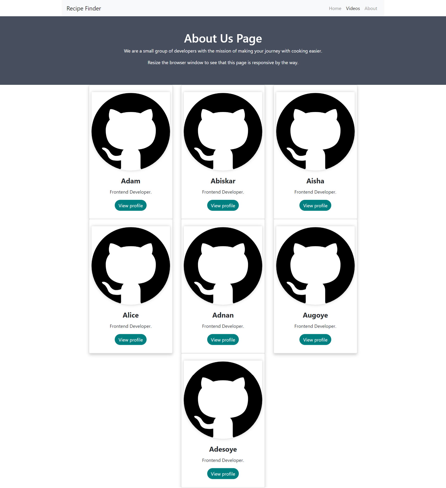

# Recipe-API-Instructions

## Description

 
- #### What was your motivation?
Create an interactive site that was able to locate recipes using the names/ingredients/food type when searched. 
- #### Why did you build this project? 
To collate recipes from various apis under one page, making it easily accessible, thus cutting off the need to go through many pages of Google Search etc.
- #### What problem does it solve?
A user is able to access a library of recipes via the api setup on a simple basic web interface.
- #### What did you learn? 
Throughout this project, we have learnt how to collaborate as a team using Git to ensure our application works seamlessly across all of our changes and commits. Additionally, we have gained more knowledge surrounding the topics covered in the Bootcamp as we have had to apply them in a time-constrained project.

## Credits

Collaborators:
    
    Adam
    https://github.com/adammbnitro
    
    Abiskar 
    https://github.com/ARbayung
    
    Aisha
    https://github.com/AishaSK
    
    Alice
    https://github.com/AliceAngelica
    
    Adnan
    https://github.com/adnan12398
    
    Augoye
    https://github.com/Themchief

    Adesoye
    https://github.com/giorhodes

## Third-party assets 

## License

Copyright (c). All rights reserved.

Licensed under the MIT license.

---

## Badges

## Features include:

We have used Bootstrap.

The project has been deployed to GitHub Pages: https://github.com/

The application is interactive (in other words, accept and respond to user input).

We have used two server-side APIs.

We have used modals instead of alerts, confirms, or prompts.

We used client-side storage to store persistent data.

We have ensured the application is super responsive.

The application has a polished UI.

Has a clean repository that meets quality coding standards (file structure, naming conventions, best practices for class/id naming conventions, indentation, quality comments, and so on).

Has a quality README (including a unique name, description, technologies used, screenshot, and link to the deployed application).

## Screenshots

Main page:

Videos page:

About us page:

